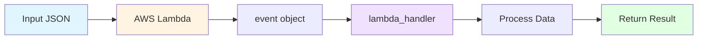
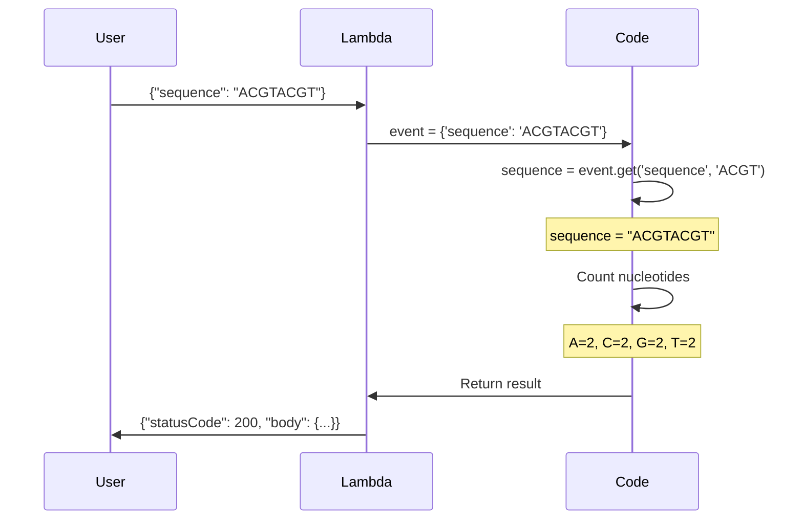
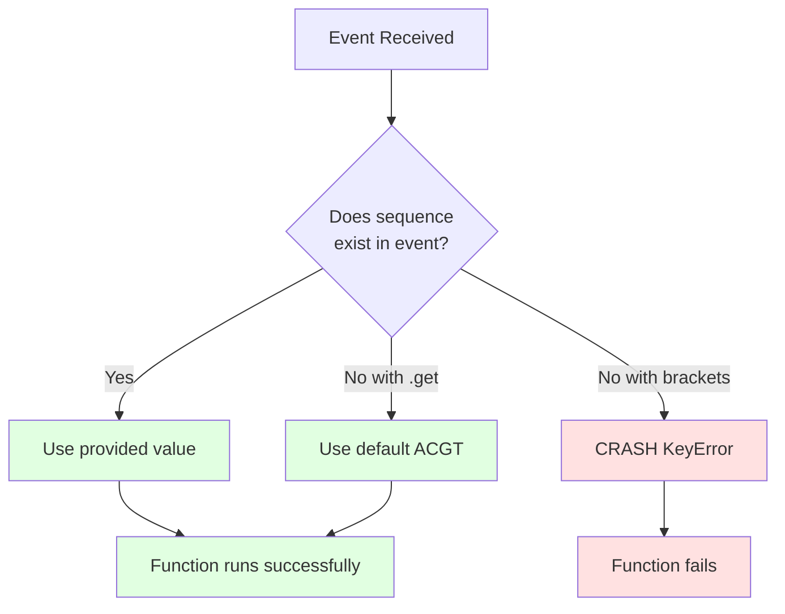
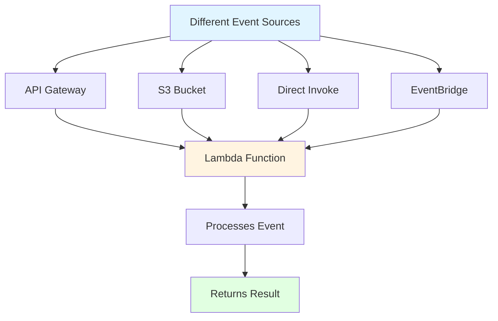
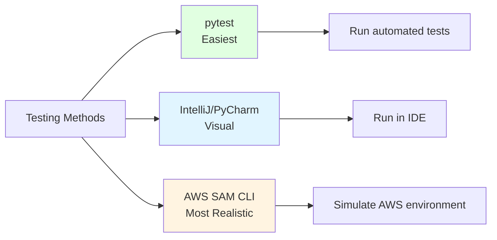

# FASTA Validator Lambda Function

## What is this?

This is an **AWS Lambda function** - a piece of code that runs in the cloud without needing to manage servers. It analyzes DNA sequences by counting nucleotides (the building blocks of DNA: A, C, G, T).

## What does it do?

**Input:** A DNA sequence like `"ACGTACGT"`

**Output:** 
- Total length of the sequence
- Count of each nucleotide (A, C, G, T)

**Example:**
```
Input:  "ACGTACGT"
Output: Length = 8, A=2, C=2, G=2, T=2
```

---

## How Lambda Functions Read Data (Understanding the Event Object)

### Lambda Function Flow Diagram



### What is the Event Object?

When AWS Lambda runs your function, it automatically passes two parameters:
1. **event** - A dictionary (like a box) containing all the input data
2. **context** - Information about the Lambda execution (we don't use this here)

### How Our Function Reads Data

Let's break down this line from `lambda_function.py`:
```python
sequence = event.get('sequence', 'ACGT')
```

**What this does:**
- `event` is a Python dictionary that looks like: `{'sequence': 'ACGTACGT'}`
- `.get('sequence', 'ACGT')` means: "Get the value for the key 'sequence'"
- `'ACGT'` is the **default value** - if 'sequence' is not found, use 'ACGT' instead

### Visual Example



**Step 1: AWS receives a request**
```json
{
  "sequence": "ACGTACGT"
}
```

**Step 2: Lambda converts it to a Python dictionary and passes it as `event`**
```python
event = {'sequence': 'ACGTACGT'}
```

**Step 3: Your code extracts the data**
```python
sequence = event.get('sequence', 'ACGT')
# sequence now contains: "ACGTACGT"
```

**Step 4: Your code processes it**
```python
len(sequence)           # Returns: 8
sequence.count('A')     # Returns: 2
```

### Why Use .get() Instead of Direct Access?



**Option 1: Using .get() (Safer - What we use)**
```python
sequence = event.get('sequence', 'ACGT')
```
- If 'sequence' exists → uses that value
- If 'sequence' is missing → uses default 'ACGT'
- **Never crashes!**

**Option 2: Direct access (Risky)**
```python
sequence = event['sequence']
```
- If 'sequence' exists → works fine
- If 'sequence' is missing → **CRASHES with KeyError!**

### Testing Different Event Structures

You can modify `event.json` to test different scenarios:

**Example 1: Normal input**
```json
{
  "sequence": "ACGTACGT"
}
```
Result: Uses "ACGTACGT"

**Example 2: Empty event (no sequence provided)**
```json
{}
```
Result: Uses default "ACGT"

**Example 3: Multiple fields (only 'sequence' is used)**
```json
{
  "sequence": "AAAA",
  "user": "student123",
  "timestamp": "2024-01-15"
}
```
Result: Uses "AAAA", ignores other fields

### Real-World Event Sources



In production, the event object can come from different AWS services:

**From API Gateway (web request):**
```json
{
  "body": "{\"sequence\": \"ACGT\"}",
  "headers": {...},
  "httpMethod": "POST"
}
```

**From S3 (file upload):**
```json
{
  "Records": [{
    "s3": {
      "bucket": {"name": "my-bucket"},
      "object": {"key": "sequence.txt"}
    }
  }]
}
```

**From our test (direct invoke):**
```json
{
  "sequence": "ACGTACGT"
}
```

Our simple function expects the direct format, but you could modify it to handle API Gateway or S3 events!

---

## How to Test (3 Methods)



### Method 1: Using pytest (Easiest for Beginners)

**What is pytest?** A testing framework that automatically runs your tests and tells you if they pass or fail.

#### Step 1: Install pytest
Open your terminal and run:
```bash
pip install pytest
```

*Note: If `pip` doesn't work, try `pip3 install pytest`*

#### Step 2: Understand the test file
The file `test_lambda_function.py` contains two tests:

1. **test_lambda_handler()** - Tests with a specific DNA sequence
2. **test_default_sequence()** - Tests what happens when no sequence is provided

#### Step 3: Run the tests
In your terminal, navigate to this folder and run:
```bash
pytest test_lambda_function.py -v
```

**What the `-v` flag does:** Shows verbose (detailed) output

**Expected output:**
```
test_lambda_function.py::test_lambda_handler PASSED
test_lambda_function.py::test_default_sequence PASSED
```

✅ **PASSED** = Your function works correctly!  
❌ **FAILED** = Something is broken (the error message will tell you what)

---

### Method 2: Using IntelliJ IDEA or PyCharm (Visual Testing)

**What is IntelliJ/PyCharm?** Professional code editors (IDEs) that make coding easier with visual tools.

#### Option A: Run pytest tests in the IDE

1. **Open the project** in IntelliJ IDEA or PyCharm
2. **Right-click** on `test_lambda_function.py` in the project explorer
3. **Select** "Run 'pytest in test_lambda...'"
4. **View results** in the bottom panel - you'll see green checkmarks ✓ for passing tests

#### Option B: Run the Lambda function directly

1. **Open** `lambda_function.py`
2. **Add this code** at the bottom of the file:
   ```python
   if __name__ == '__main__':
       # Test event - simulates what AWS Lambda would receive
       test_event = {'sequence': 'ACGTACGT'}
       result = lambda_handler(test_event, {})
       print(result)
   ```
3. **Right-click** anywhere in the file
4. **Select** "Run 'lambda_function'"
5. **See the output** in the console at the bottom

**What you should see:**
```python
{
  'statusCode': 200,
  'body': {
    'sequence_length': 8,
    'nucleotide_counts': {'A': 2, 'C': 2, 'G': 2, 'T': 2}
  }
}
```

---

### Method 3: Using AWS SAM CLI (Most Realistic)

**What is SAM CLI?** AWS Serverless Application Model CLI - a tool that simulates the real AWS Lambda environment on your computer.

**Why use this?** It tests your function exactly as it would run in AWS.

#### Step 1: Install AWS SAM CLI

**On macOS:**
```bash
brew install aws-sam-cli
```

**On Windows/Linux:** Follow instructions at https://docs.aws.amazon.com/serverless-application-model/latest/developerguide/install-sam-cli.html

#### Step 2: Create a SAM template

Create a file named `template.yaml` in this folder:
```yaml
AWSTemplateFormatVersion: '2010-09-09'
Transform: AWS::Serverless-2016-10-31

Resources:
  FastaValidatorFunction:
    Type: AWS::Serverless::Function
    Properties:
      Handler: lambda_function.lambda_handler
      Runtime: python3.12
      CodeUri: .
```

**What this file does:** Tells SAM how to run your Lambda function (which file, which Python version, etc.)

#### Step 3: Test with SAM

The file `event.json` contains test data. Run:
```bash
sam local invoke -e event.json
```

**What happens:**
1. SAM creates a Docker container (mini virtual computer)
2. Runs your Lambda function inside it
3. Shows you the result

**Expected output:**
```json
{
  "statusCode": 200,
  "body": {
    "sequence_length": 8,
    "nucleotide_counts": {
      "A": 2,
      "C": 2,
      "G": 2,
      "T": 2
    }
  }
}
```

---

## Testing with Different DNA Sequences

### Modify event.json

Open `event.json` and change the sequence:

```json
{
  "sequence": "AAATTTGGGCCC"
}
```

Then run any of the testing methods above to see different results!

### Try these examples:

1. **All same nucleotide:** `"AAAA"` → Should count A=4, others=0
2. **Long sequence:** `"ACGTACGTACGTACGT"` → Should count length=16
3. **Empty sequence:** `""` → Should count length=0

---

## Common Issues & Solutions

### "pip: command not found"
**Solution:** Try `pip3` instead of `pip`, or install Python from python.org

### "pytest: command not found" 
**Solution:** After installing pytest, close and reopen your terminal

### "ModuleNotFoundError: No module named 'lambda_function'"
**Solution:** Make sure you're running the command from the `lab1` folder

### SAM CLI errors about Docker
**Solution:** Install Docker Desktop from docker.com - SAM needs it to run

---

## What's Next?

Once your tests pass, you can:
1. **Deploy to AWS** - Upload this function to real AWS Lambda
2. **Add more features** - Validate that sequences only contain A, C, G, T
3. **Handle errors** - What if someone sends invalid data?
4. **Connect to API** - Make it accessible via a web URL

---

## Glossary

- **Lambda function:** Code that runs in the cloud without managing servers
- **Event:** The input data sent to your Lambda function (JSON format)
- **Handler:** The main function that Lambda calls (lambda_handler in our case)
- **Assert:** A test statement that checks if something is true
- **pytest:** A Python testing framework
- **SAM:** AWS tool for building and testing serverless applications
