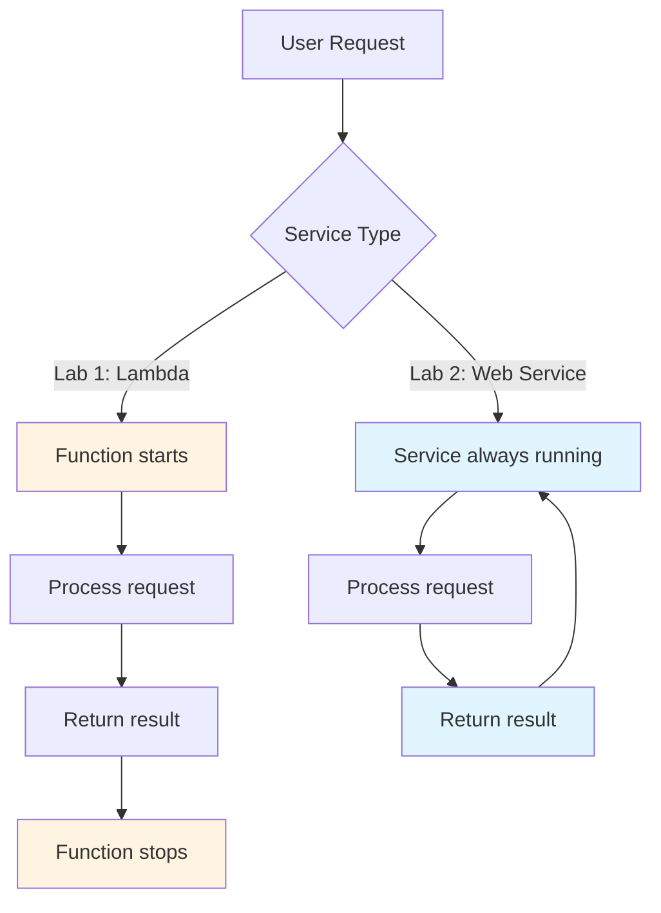
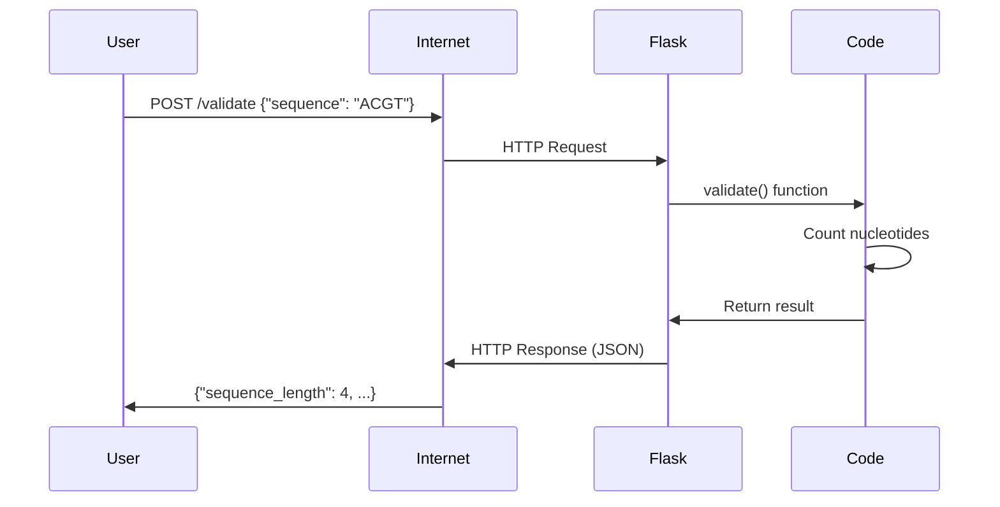
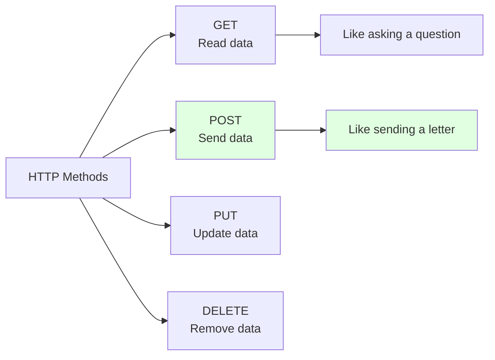
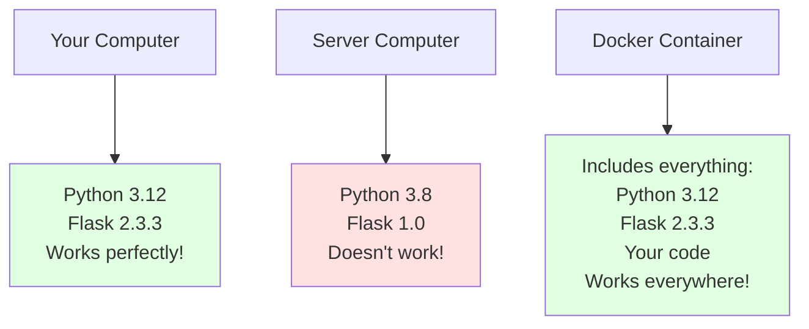
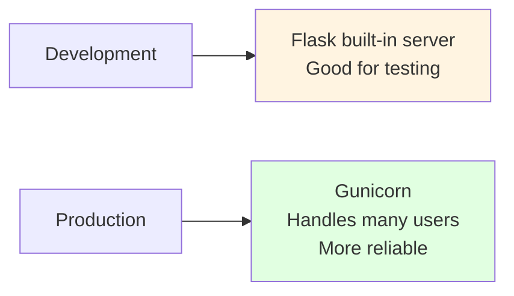
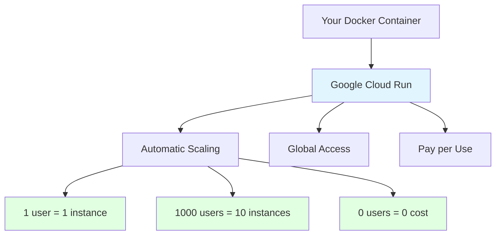
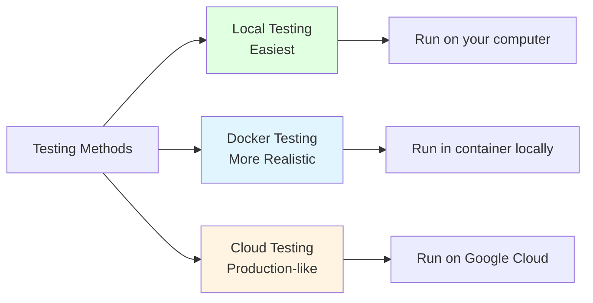

# FASTA Validator Web Service

## What is this?

This is a **web service** - a program that runs on the internet and can be accessed through web requests. Unlike Lab 1 (which was a single function), this is a complete web application that can handle multiple requests from different users at the same time.

**Key difference from Lab 1:**
- **Lab 1:** AWS Lambda function (runs only when called, then stops)
- **Lab 2:** Web service (runs continuously, always ready to respond)

## What does it do?

**Same functionality as Lab 1, but accessible via the web:**

**Input:** Send a web request with a DNA sequence like `"ACGTACGT"`

**Output:** 
- Total length of the sequence
- Count of each nucleotide (A, C, G, T)

**Example:**
```
Input:  POST request with {"sequence": "ACGTACGT"}
Output: {"sequence_length": 8, "nucleotide_counts": {"A": 2, "C": 2, "G": 2, "T": 2}}
```

---

## Understanding Web Services vs Functions



**Lambda Function (Lab 1):**
- Starts when needed → Processes → Stops
- Like calling a taxi: comes when you need it, leaves when done
- Pay only when it runs

**Web Service (Lab 2):**
- Always running and waiting for requests
- Like having a personal driver: always available
- Costs more but responds faster

---

## How Web Services Work (Understanding Flask)

### What is Flask?

**Flask** is a Python framework that makes it easy to create web services. Think of it as a helpful assistant that:
- Listens for web requests
- Calls your code to process them
- Sends back responses

### Web Service Flow Diagram



### Understanding the Code Structure

Let's break down `main.py`:

```python
from flask import Flask, request, jsonify

app = Flask(__name__)
```
**What this does:**
- Import Flask tools
- Create a Flask application called `app`

```python
@app.route('/validate', methods=['POST'])
def validate():
```
**What this does:**
- `@app.route('/validate', methods=['POST'])` tells Flask: "When someone sends a POST request to `/validate`, run the `validate()` function"
- This is called a **route** - like a street address for your function

```python
data = request.get_json()
sequence = data.get('sequence', 'ACGT')
```
**What this does:**
- `request.get_json()` gets the JSON data from the web request
- `data.get('sequence', 'ACGT')` extracts the sequence (same logic as Lab 1!)

```python
return jsonify(result)
```
**What this does:**
- Converts the Python dictionary to JSON format
- Sends it back as a web response

### HTTP Methods Explained



**Our service uses POST because:**
- We're sending data (the DNA sequence) to the server
- GET requests don't have a body for data
- POST is the standard for sending information

---

## What is Docker? (Understanding Containers)

### The Problem Docker Solves



**Without Docker:** "It works on my machine!" 😞
**With Docker:** "It works everywhere!" 😊

### What is a Container?

Think of a Docker container like a **shipping container**:
- Contains everything needed (your code + Python + libraries)
- Can be moved anywhere (your computer, Google Cloud, AWS, etc.)
- Always works the same way

### Understanding the Dockerfile

The `Dockerfile` is like a recipe for creating your container:

```dockerfile
FROM python:3.12-slim
```
**What this does:** Start with a basic Linux computer that has Python 3.12 installed

```dockerfile
WORKDIR /app
```
**What this does:** Create a folder called `/app` and work inside it

```dockerfile
COPY requirements.txt .
RUN pip install -r requirements.txt
```
**What this does:** 
- Copy the list of needed libraries
- Install them (Flask and gunicorn)

```dockerfile
COPY main.py .
```
**What this does:** Copy your Python code into the container

```dockerfile
CMD exec gunicorn --bind :8080 --workers 1 --threads 2 main:app
```
**What this does:** Start the web service using gunicorn (a production web server)

### Why Gunicorn Instead of Flask Directly?



**Flask's built-in server:** Like a bicycle - fine for one person
**Gunicorn:** Like a bus - can handle many people at once

---

## What is Google Cloud Run?

### Cloud Run Explained

**Google Cloud Run** is a service that:
- Takes your Docker container
- Runs it on Google's computers
- Automatically handles web traffic
- Scales up when busy, scales down when quiet



### Benefits of Cloud Run

1. **Serverless:** No servers to manage
2. **Scalable:** Handles 1 or 1,000,000 users
3. **Cost-effective:** Pay only when used
4. **Fast:** Starts containers in milliseconds

---

## How to Test (3 Methods)



### Method 1: Local Testing (Easiest for Beginners)

**What this does:** Runs the web service directly on your computer

#### Step 1: Install dependencies
Open your terminal and navigate to this folder, then run:
```bash
pip install -r requirements.txt
```

#### Step 2: Start the service
```bash
python main.py
```

**What you should see:**
```
* Running on all addresses (0.0.0.0)
* Running on http://127.0.0.1:8080
* Running on http://[your-ip]:8080
```

#### Step 3: Test with curl (in another terminal)
```bash
curl -X POST http://localhost:8080/validate \
  -H "Content-Type: application/json" \
  -d '{"sequence": "ACGTACGT"}'
```

**Expected response:**
```json
{
  "nucleotide_counts": {
    "A": 2,
    "C": 2,
    "G": 2,
    "T": 2
  },
  "sequence_length": 8
}
```

#### Step 4: Stop the service
Press `Ctrl+C` in the terminal where the service is running

---

### Method 2: Docker Testing (More Realistic)

**What this does:** Tests your service exactly as it will run in the cloud

#### Step 1: Install Docker
- **macOS:** Download Docker Desktop from https://docker.com
- **Windows:** Download Docker Desktop from https://docker.com
- **Linux:** Follow instructions for your distribution

#### Step 2: Build the container
```bash
docker build -t fasta-validator .
```

**What this does:** Creates a container image called `fasta-validator` using your Dockerfile

#### Step 3: Run the container
```bash
docker run -p 8080:8080 fasta-validator
```

**What this does:**
- Starts your container
- Maps port 8080 from the container to port 8080 on your computer
- `-p 8080:8080` means "connect container port 8080 to computer port 8080"

#### Step 4: Test (same as Method 1)
```bash
curl -X POST http://localhost:8080/validate \
  -H "Content-Type: application/json" \
  -d '{"sequence": "ACGTACGT"}'
```

#### Step 5: Stop the container
Press `Ctrl+C`

---

### Method 3: Cloud Testing (Production-like)

**What this does:** Deploys your service to Google Cloud Run

#### Prerequisites
1. **Google Cloud Account:** Sign up at https://cloud.google.com
2. **Google Cloud CLI:** Install from https://cloud.google.com/sdk/docs/install

#### Step 1: Understand the deployment script

The `deploy.sh` script does several things:

```bash
gcloud auth login
```
**What this does:** Logs you into Google Cloud

```bash
gcloud config set project <your-project-name>
```
**What this does:** Sets the Google Cloud project to use

```bash
gcloud services enable run.googleapis.com --project=<your-project-name>
gcloud services enable cloudbuild.googleapis.com --project=<your-project-name>
```
**What this does:** Enables the services needed (Cloud Run and Cloud Build)

```bash
gcloud run deploy fasta-validator-service \
    --source . \
    --platform managed \
    --no-allow-unauthenticated \
    --region europe-west4 \
    --memory 512Mi \
    --cpu 1
```
**What this does:**
- `deploy fasta-validator-service`: Creates a service with this name
- `--source .`: Uses the current folder (your code)
- `--platform managed`: Uses Google's managed Cloud Run
- `--no-allow-unauthenticated`: Requires authentication to access
- `--region europe-west4`: Runs in Europe
- `--memory 512Mi`: Allocates 512MB of memory
- `--cpu 1`: Allocates 1 CPU

#### Step 2: Run the deployment
```bash
chmod +x deploy.sh
./deploy.sh
```

#### Step 3: Test the deployed service

After deployment, you'll get a URL like:
```
https://fasta-validator-your-name-abc123-ew.a.run.app
```

Test it:
```bash
curl -X POST https://your-service-url/validate \
  -H "Content-Type: application/json" \
  -H "Authorization: Bearer $(gcloud auth print-access-token)" \
  -d '{"sequence": "ACGTACGT"}'
```

**Note:** The `Authorization` header is needed because we set `--no-allow-unauthenticated`

---

## Testing with Different Tools

### Using Postman (Visual Testing)

**What is Postman?** A visual tool for testing web services

1. **Download Postman** from https://postman.com
2. **Create a new request:**
   - Method: POST
   - URL: `http://localhost:8080/validate` (or your Cloud Run URL)
   - Headers: `Content-Type: application/json`
   - Body (raw JSON):
     ```json
     {
       "sequence": "ACGTACGT"
     }
     ```
3. **Click Send**
4. **See the response** in the bottom panel

### Using a Web Browser (For GET requests)

**Note:** Browsers can only make GET requests easily, but our service uses POST. However, you can check if the service is running by visiting the URL - you'll get an error, but it confirms the service is alive.

---

## Comparing Lab 1 vs Lab 2

| Aspect | Lab 1 (AWS Lambda) | Lab 2 (GCP Cloud Run) |
|--------|-------------------|----------------------|
| **Type** | Function | Web Service |
| **Runs** | Only when called | Continuously |
| **Input** | Event object | HTTP request |
| **Output** | Return value | HTTP response |
| **Testing** | Direct function call | HTTP request |
| **Scaling** | Automatic | Automatic |
| **Cost** | Per execution | Per request + idle time |
| **Startup** | Cold start possible | Faster response |

### When to Use Each?

**Use Lambda (Lab 1) when:**
- Simple, single-purpose functions
- Triggered by events (file uploads, database changes)
- Infrequent usage
- Want minimal cost

**Use Cloud Run (Lab 2) when:**
- Web APIs and services
- Need consistent response times
- Multiple endpoints
- Existing web applications

---

## Common Issues and Solutions

### Issue 1: "Port already in use"
**Problem:** Another service is using port 8080
**Solution:** 
```bash
# Find what's using the port
lsof -i :8080

# Kill the process (replace PID with actual number)
kill -9 PID

# Or use a different port
python main.py --port 8081
```

### Issue 2: "Module not found"
**Problem:** Flask not installed
**Solution:**
```bash
pip install -r requirements.txt
```

### Issue 3: Docker build fails
**Problem:** Docker not running or not installed
**Solution:**
1. Make sure Docker Desktop is running
2. Check Docker installation: `docker --version`

### Issue 4: Cloud deployment fails
**Problem:** Authentication or project issues
**Solution:**
1. Check login: `gcloud auth list`
2. Check project: `gcloud config get-value project`
3. Enable required APIs in Google Cloud Console

---

## Next Steps

After completing this lab, you understand:
- ✅ Web services vs functions
- ✅ Flask framework basics
- ✅ Docker containers
- ✅ Google Cloud Run
- ✅ HTTP requests and responses

**Try these experiments:**
1. Add a new endpoint (e.g., `/health` that returns "OK")
2. Modify the response format
3. Add input validation
4. Deploy with different memory/CPU settings